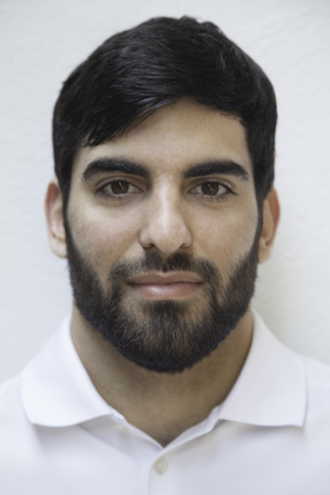

Aside
================================================================================
{width=80%}

Contact Info {#contact}
--------------------------------------------------------------------------------

- <i class="fa fa-envelope"></i> k.gramage@tum.de
- <i class="fa fa-linkedin"></i> [linkedin.com/in/kevingm](https://linkedin.com/in/kevingm/)
<!-- - <i class="fa fa-github"></i> [github.com/kevin-exo](https://github.com/kevin-exo) -->
- <i class="fa fa-phone"></i> +34 670287311
<!-- - For more information, please contact me via email. -->
  
  
  
Skills {#skills}
--------------------------------------------------------------------------------
<!-- - Experienced in statistical analysis, statistical learning models, and optimization methods. -->
**Languages**  

*Native:*  
- Spanish  

*Fluent:*  
- English (TOEFL 105)  
- Catalan

*Towards fluency:*  
- German  
- French  

<!-- **Programming:**   -->
<!-- R | GitHub   -->

<!-- <!-- C# | MS Visual Studio   -->
<!-- <!-- Motion Capture Systems:  -->
<!-- **Human Movement Analysis:**   -->
<!-- Vicon | Contemplas   -->
<!-- IMUs (e.g. APDM)   -->
<!-- IsoMed | Biodex   -->
<!-- AMTI | Kistler - Force Plates   -->
<!-- proEMG | LabChart -->
  

Disclaimer {#disclaimer}
--------------------------------------------------------------------------------

<!-- This resume was made with the R package [**pagedown**](https://github.com/rstudio/pagedown). -->
  
Last updated on `r Sys.Date()`.

Main
================================================================================

Kevin Gramage {#title}
--------------------------------------------------------------------------------

  
### Searching for a position in Biomechanics  
<!-- & Human Movement Analysis -->
<!-- ### Currently searching for a PhD student position -->

At the moment: MSc. Thesis at Institut de Myologie: “The use of lower limb exoskeleton in patients with myopathies”

<!-- Worked for over 7 years as a sport Coach and Educator but also collected experience in Sales and Event Management. -->
<!-- All while moving towards a career in Exercise Sciences research. -->

Education {data-icon=graduation-cap data-concise=true}
--------------------------------------------------------------------------------

### Master of Sport & Exercise Sciences

Technical University of Munich

Munich, Germany

Currently (Exp. SEP '20)

<!-- Focus in Biomechanics & Exercise biology.   -->
- Thesis: "The use of lower limb exoskeleton in patients with myopathies"

### Bachelor of Sport Sciences

Universidad Politécnica de Madrid

Madrid, Spain

2017

- Thesis: ["Perfil Antropométrico Y Fisiológico Del Jugador De Fútbol Americano"](http://doi.org/dqt3) *Excellent with distinction* grade

Research Experience {data-icon=laptop}
--------------------------------------------------------------------------------

### Internship -> MSc. Thesis

Institut de Myologie, Pitié-Salpêtrière Hospital

Paris, France

JUN 19 - Currently

- Evaluate the safety, usability, and acute efficiency of a powered knee-hip dermoskeleton in patients with neuromuscular disorders.
- Elaborate recommendations regarding usability criteria for safe and efficient use the device in patients with neuromuscular disorders (e.g. type and severity of patient’s functional deficits).
- Generate necessary data to foresee a future study involving a home use of the device and assessment of long-term benefits.

### Student Assistant

Actibelt®, Trium Analysis Online GmbH

Munich, Germany

2018 - 2019

- Gait analysis of patients with reduced mobility participating in clinical trials and produce clinical research studies.
- Video & accelerometer data processing using R statistical software.
- Synchronize actibelt® and video data using in-house annotation software.
- Assist on data collection during the trials performed with the actibelt®.

<!-- Professional Experience {data-icon=suitcase} -->
<!-- -------------------------------------------------------------------------------- -->

Relevant Course Projects {.page-break-before data-icon=chalkboard-teacher}
--------------------------------------------------------------------------------

### Eccentric Maximum Voluntary Contractions
<!-- : Familiarization & Reliability -->
Muscle function and human movement | Individual project

N/A

OCT 18 - FEB 19

- Intra-session and Inter-day comparision of EMVC

<!-- ::: concise -->
- Use of Isomed® dynamometer, Myon320 mobile® EMG & prophysics proEMG®
- [Poster DOI: 10.13140/RG.2.2.11515.46887](https://www.doi.org/10.13140/RG.2.2.11515.46887)  
  
<!-- ::: -->

::: aside

**Data Analysis & Programming**  

<i class="fab fa-r-project"></i> R | RStudio  
<i class="fab fa-github"></i> GitHub  

:::

### Personalised approach to exercise, diet & medical treatment
<!-- Eccentric Maximum Voluntary Contractions: Familiarization & Reliability -->
Exercise biology specialization | Group project

N/A

OCT 18 - FEB 19

- Pre-post analysis and comparison of an 8-week exercise intervention.
- Personalized approach to exercise, diet and medical treatment.

::: aside

**Human Movement Tools**  

*Motion capture*  
- Vicon  
- Contemplas  

*IMUs*  
- APDM | Opal  
- Actibelt  

*Dynamometers*  
- IsoMed  
- Biodex  

*Force Plates*  
- AMTI
- Kistler   

*Signal analysis*  
- LabChart  
- proEMG  
:::

### Biomechanical methods and application
Group projects

N/A 

MAY - SEP 18

- “Anthropometric analysis & somatotype classification of a subject”
- “2D kinematic analysis of lower extremity joints during the run”
- “Effects of Post-Activation Potentiation (PAP) & fatigue on CMJ”
- “Neuromechanical adaptation induced by elastic surface jumping”

<!-- Selected Publications and Posters {data-icon=file} -->
<!-- -------------------------------------------------------------------------------- -->

<!-- ### Genetic and epigenetic signals are found predictive to the distribution of intra-individual divergence of alternative splicing. -->

<!-- Poster for 2013 International Conference of Genomics -->

<!-- Qingdao, China -->

<!-- 2014 -->

<!-- **Yu L**, Chen B, Zhang Z. -->

<!-- ### ESCRT-0 complex modulates Rbf mutant cell survival by regulating Rhomboid endosomal trafficking and EGFR signaling. -->

<!-- J Cell Sci. 2016 May 15;129(10):2075-84. -->

<!-- N/A -->

<!-- 2016  -->

<!-- Sheng Z, **Yu L**, Zhang T, Pei X, Li X, Zhang Z and Du W.  -->
